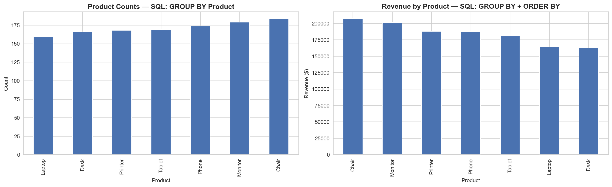
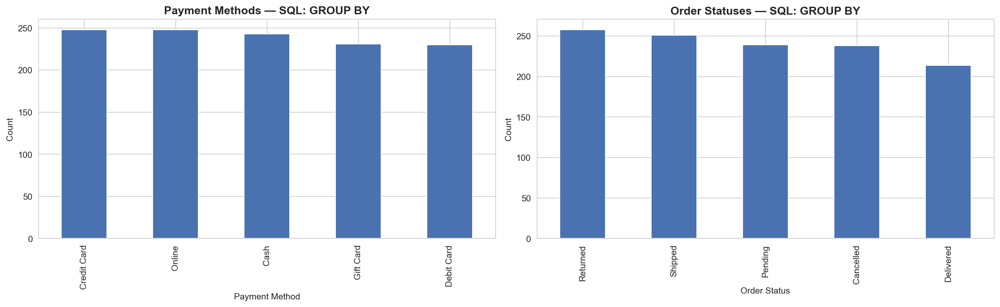
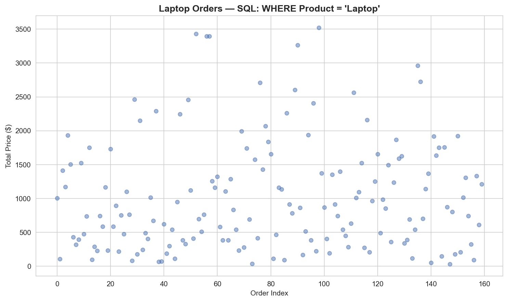

# Decode Labs — SQL-Based EDA

Project 3 from my internship at Decode Labs. Same synthetic e-commerce dataset as Project 2, but this time I queried it using SQL through the `pandasql` library instead of pandas methods.

---

## What it does

The notebook loads order data and runs SQL queries against it:

- **Product counts** — `GROUP BY Product`
- **Revenue ranking** — `GROUP BY Product ORDER BY revenue DESC`
- **Payment method breakdown** — `GROUP BY PaymentMethod`
- **Order status breakdown** — `GROUP BY OrderStatus`
- **Product filter** — `WHERE Product = 'Laptop'`

---

## Screenshots

### Product Analysis

Counts are fairly even across all seven products. Revenue is more spread out — Chair and Printer lead, Phone trails.

### Payments & Order Status

Payment methods are almost evenly split. Order statuses are also balanced — the dataset was clearly built that way on purpose.

### Laptop Orders Filter

Filtered down to 173 laptop orders. Prices range from under 50 to nearly 3000 depending on quantity.

---

## Dataset

Same structure as Project 2 — synthetic e-commerce data, 1200 rows. The notebook expects `Dataset for Data Analytics (1).xlsx` which is not included in this repo.

## Stack

Python, pandasql, pandas. Runs on Google Colab.

## How to run

Open in Google Colab. The first cell installs `pandasql` via pip. Upload the data file and run all cells.
